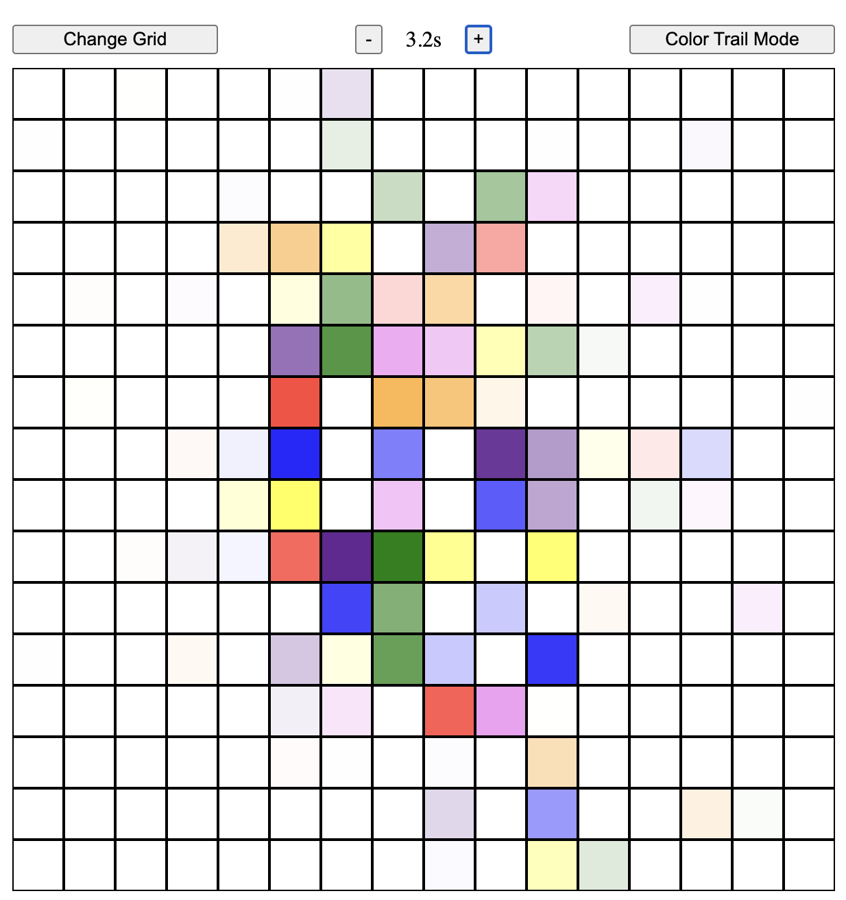
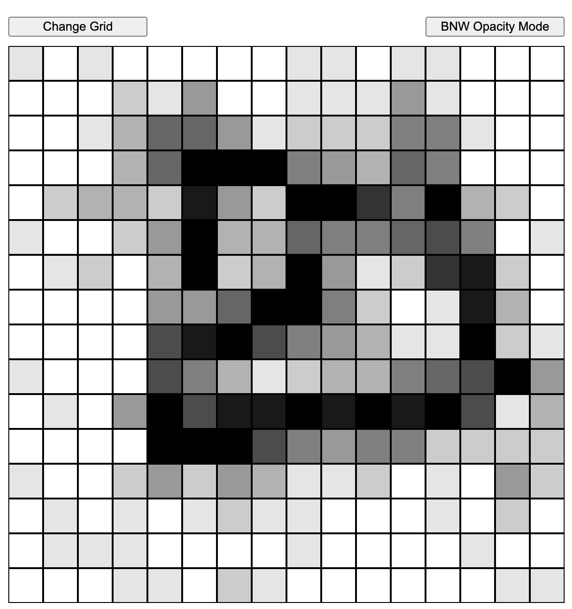
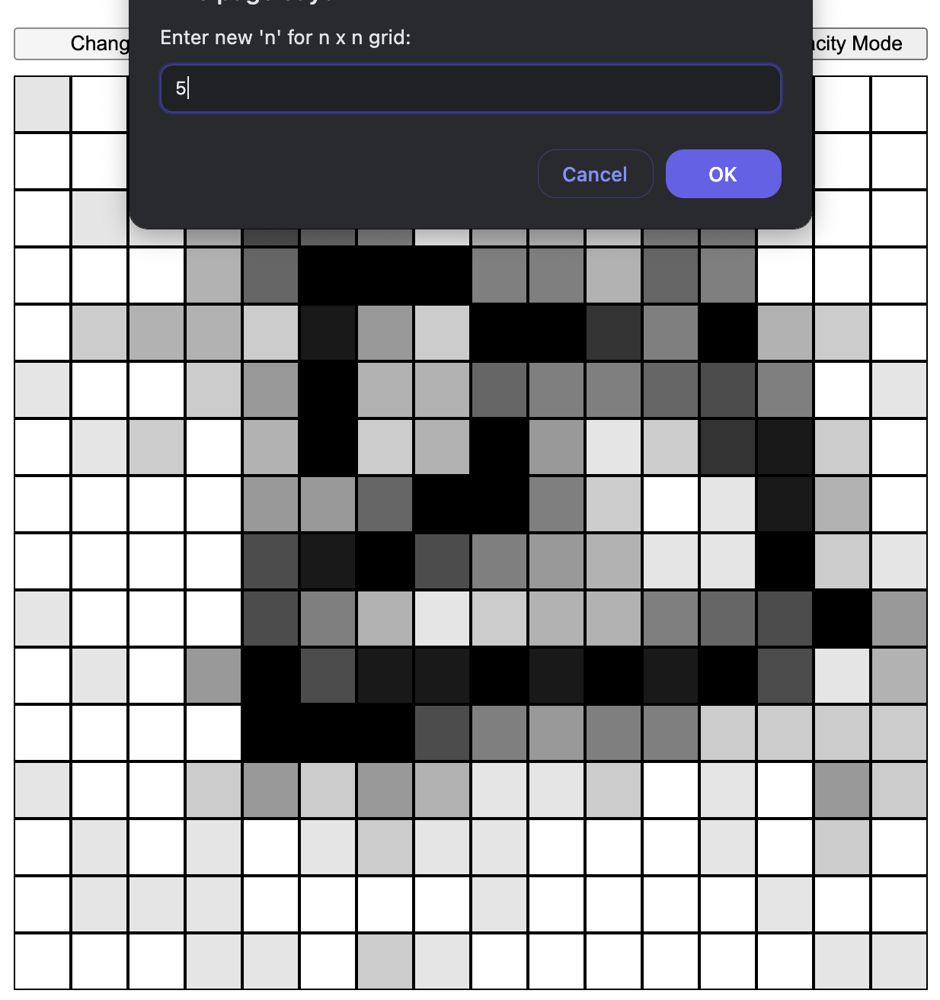
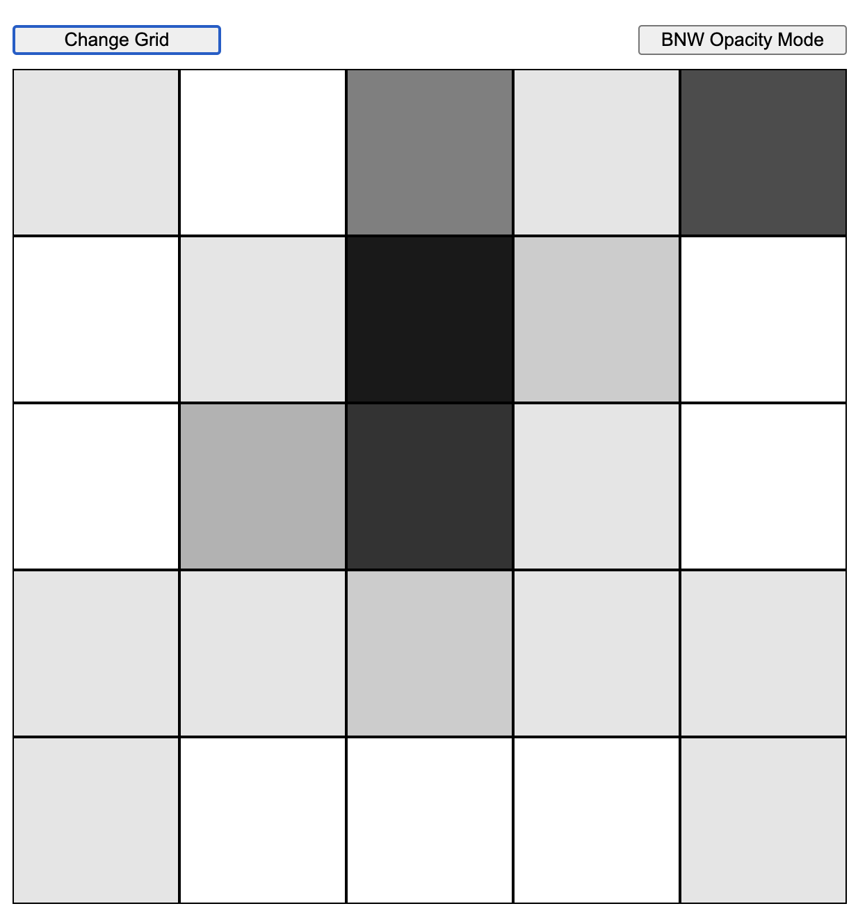
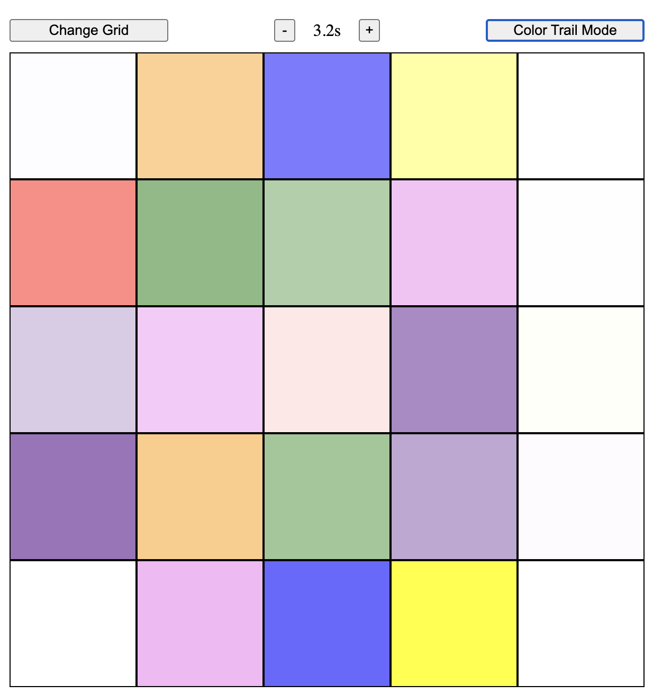

# Etch-a-Sketch

template/prompt from [the odin project's fullstack-js](https://www.theodinproject.com/paths/full-stack-javascript).

## todo

- [x] change gridsize
- [x] shade on hover
- [x] random color on hover
- [x] fade off hover
- [x] customize fade duration
- [x] opacity mode
- [ ] implement modal
- [ ] gamify(?)
- [ ] better UI(?)
- [ ] text on sides(?)

## _screens_

